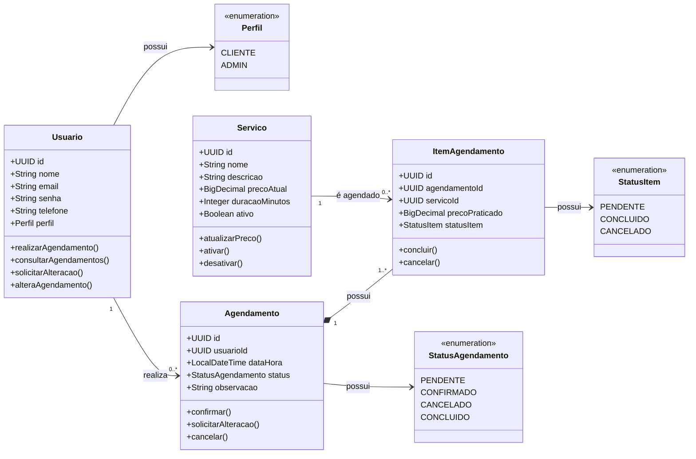
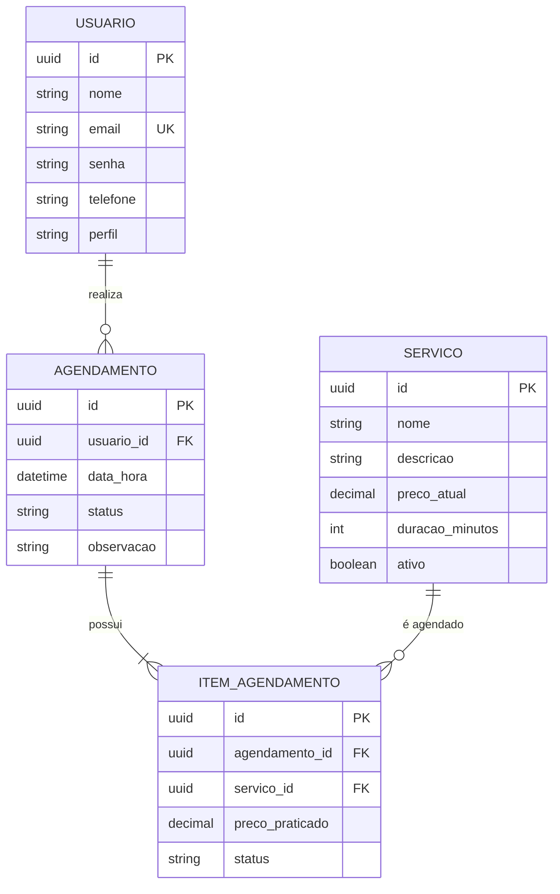

# Cabeleleila Leila - Sistema de Agendamento

Sistema de agendamento online desenvolvido como teste prático para a vaga de Desenvolvedora na DSIN. A proposta simula um salão de beleza que precisa de uma solução própria para que clientes agendem serviços online, com regras de negócio específicas e um painel de controle para a proprietária.

## Tecnologias utilizadas

- Java 21
- Spring Boot 4.1.1
- Spring Web
- Spring Data JPA (Hibernate)
- Spring Validation
- MySQL 8
- Maven
- Lombok
- HTML, CSS e JavaScript puro (front-end, sem framework e sem build tool)

## Arquitetura

O back-end segue arquitetura em camadas:

- **Controller**: recebe requisições HTTP e delega para a camada de serviço, sem lógica de negócio.
- **Service**: concentra as regras de negócio (validações, cálculos, transições de status).
- **Repository**: interfaces Spring Data JPA responsáveis pelo acesso ao banco.
- **Model**: entidades JPA mapeadas para as tabelas do banco.
- **DTO**: objetos de transferência usados para não expor dados sensíveis (como senha) e para receber dados de entrada que não correspondem diretamente a uma entidade.

O front-end é servido como arquivo estático pelo próprio Spring Boot (pasta `src/main/resources/static`) e se comunica com a API via `fetch`. O back-end expõe uma configuração de CORS permissiva (`WebConfig`), pensada para cobrir o cenário de abrir os arquivos HTML diretamente durante o desenvolvimento, sem passar pelo Spring; na forma como o projeto é executado nesta entrega, front e back rodam na mesma origem, então essa configuração não chega a ser exigida, mas foi mantida por flexibilidade.

## Modelagem de Domínio



> **Observação:** este diagrama representa a intenção original de modelagem, pensada como Rich Domain Model (métodos de comportamento, como `confirmar()` e `ativar()`, vivendo nas próprias entidades). Durante a implementação, optei por manter as entidades JPA anêmicas — apenas atributos, com getters/setters gerados pelo Lombok — e concentrar toda a lógica de negócio na camada de Service (`AgendamentoService`, `ServicoService`, `UsuarioService`), seguindo a arquitetura em camadas descrita acima. Como consequência dessa escolha, no código: o `id` é do tipo `String` (armazenando o UUID como texto, não o tipo `UUID`), e os relacionamentos como `Agendamento.usuarioId` ou `ItemAgendamento.agendamentoId`/`servicoId` são, na prática, referências de objeto via `@ManyToOne` (`Usuario usuario`, `Agendamento agendamento`, `Servico servico`), não ids soltos.

## Modelagem de Dados

O banco possui quatro tabelas principais: `usuario`, `servico`, `agendamento` e `item_agendamento`. Um agendamento pode conter um ou mais serviços, cada um registrado como um item independente, com preço praticado próprio, preservando o histórico mesmo que o preço do serviço mude no futuro.

As chaves estrangeiras de `agendamento.usuario_id` e `item_agendamento.agendamento_id` usam `ON DELETE CASCADE`: remover um usuário remove seus agendamentos, e remover um agendamento remove seus itens, evitando registros órfãos no banco.

### Diagrama ER



O script de criação das tabelas está disponível em [`database/schema.sql`](database/schema.sql), e reflete exatamente a estrutura descrita no diagrama ER acima.

## Como executar o projeto

### Pré-requisitos

- JDK 21 instalado
- MySQL 8 rodando localmente
- Maven (ou usar o wrapper `mvnw` incluso no projeto, que não exige Maven instalado)

### Passo a passo

1. Clone o repositório:

```
git clone https://github.com/brunaandradea/cabeleleila-leila.git
```

2. Crie o banco de dados executando o script SQL disponível em [`database/schema.sql`](database/schema.sql) no MySQL Workbench ou via linha de comando.

3. Configure as credenciais do banco em `src/main/resources/application.properties`:

```
spring.datasource.url=jdbc:mysql://localhost:3306/salao_db
spring.datasource.username=root
spring.datasource.password=root123@
```

4. Rode a aplicação:

```
./mvnw spring-boot:run
```

ou execute a classe `CabeleleilaLeilaApplication` diretamente pela IDE.

5. Acesse o sistema pelo navegador:

```
http://localhost:8080/index.html
```

Na tela inicial, selecione um usuário existente para navegar como cliente ou administrador. Não há autenticação real implementada (ver observações abaixo).

## Funcionalidades implementadas

### Fundamental

- Cadastro, listagem, atualização e remoção de usuários
- Cadastro, listagem e atualização de serviços (ativação e desativação em vez de exclusão)
- Criação de agendamento com um ou mais serviços, validando se cada serviço está ativo
- Alteração de data e hora do agendamento, respeitando a regra de que alterações a menos de 2 dias do horário marcado não são permitidas pelo sistema
- Sugestão automática de mesma data quando o cliente já possui outro agendamento na mesma semana
- Histórico de agendamentos por usuário, com detalhamento dos serviços de cada agendamento

### Diferencial

- Confirmação de agendamento pela administradora
- Gerenciamento de status de cada item de agendamento (concluir, cancelar) — disponível via API (`PATCH /agendamentos/itens/{itemId}/concluir` e `/cancelar`); o painel administrativo atual gerencia o status no nível do agendamento, não item a item
- Painel administrativo com listagem geral de agendamentos, gerenciamento de status e controle de serviços
- Relatório de desempenho semanal (total de agendamentos, concluídos, cancelados e faturamento)
- Restrição de horário comercial: agendamentos só podem ser criados ou alterados de terça a sábado, entre 08:00 e 18:00
- Restrição de acesso às rotas administrativas: o back-end valida, a partir do usuário logado, se ele tem perfil ADMIN antes de liberar rotas como listagem geral de agendamentos, relatório semanal e gerenciamento de serviços (ver observações abaixo)

## Decisões e observações

Este projeto envolveu algumas interpretações de regras que o enunciado não detalhava por completo. Documentei aqui as principais, para deixar claro o raciocínio por trás de cada uma:

- "2 dias" foi interpretado como 48 horas corridas, contadas a partir do momento da tentativa de alteração até a data marcada do agendamento, não como dias de calendário.
- "Mesma semana" foi interpretada como semana de calendário, de segunda-feira a domingo, não como uma janela de 7 dias corridos a partir do primeiro agendamento.
- Horário comercial foi interpretado como das 08:00 (inclusive) às 18:00 (exclusive) — ou seja, o último horário de início aceito é 17:30, considerando agendamentos em intervalos de 30 minutos.
- A entidade Profissional foi removida da modelagem. O case descreve apenas a própria Leila prestando os serviços, sem menção a equipe, então adicionar essa entidade seria escopo além do que foi pedido. O controle de quem é administradora é feito por um campo `perfil` na própria entidade Usuario.
- Enums são armazenados como VARCHAR, com controle de valores válidos feito pela aplicação via `@Enumerated(EnumType.STRING)`, em vez de tabelas de lookup normalizadas. Essa abordagem é mais simples de manter e suficiente para o volume de dados do projeto.
- A senha do usuário nunca é retornada pela API. Todas as respostas que envolvem Usuario passam por um DTO específico que expõe apenas os campos necessários.
- Não existe autenticação real implementada. A tela inicial simula um login permitindo escolher um usuário existente da lista, sem validação de senha. Autenticação de verdade, com sessão ou token, ficou fora do escopo dado o prazo de entrega.
- Como não há autenticação de verdade, a autorização das rotas administrativas foi implementada com um interceptor no back-end (`AdminAccessInterceptor`) que lê o id do usuário logado (enviado pelo front no cabeçalho `X-Usuario-Id`) e consulta o perfil desse usuário direto no banco antes de liberar a rota — o perfil nunca é confiado a partir do que o front informa. Isso resolve o problema de qualquer pessoa conseguir acessar rotas administrativas manipulando o `localStorage` ou chamando a API diretamente, mas é importante deixar claro o limite dessa abordagem: como o id do usuário não é assinado nem criptografado, alguém que descubra o id de um administrador ainda poderia forjar esse cabeçalho manualmente. Uma solução completa exigiria autenticação de verdade (Spring Security, sessão ou token), que ficou fora do escopo dado o prazo.
- Existem dois endpoints para confirmar um agendamento: um dedicado (`/agendamentos/{id}/confirmar`) e um genérico de transição de status (`/agendamentos/{id}/status`), que também cobre outras transições válidas (confirmado para concluído ou cancelado, por exemplo). Os dois convivem porque foram construídos em momentos diferentes do desenvolvimento, e ambos aplicam a mesma validação de transição de estado.
- Testes automatizados não foram implementados formalmente. A validação das regras de negócio foi feita manualmente durante o desenvolvimento, através de execuções controladas removidas antes da entrega final.

## Prints e vídeo de demonstração

Prints das telas do sistema em funcionamento e vídeo de demonstração disponíveis em: https://drive.google.com/drive/folders/1q91tKEky2XXu1sARvJDfUByhdLO36Jik?usp=sharing

## Autora

Bruna Andrade Alves
